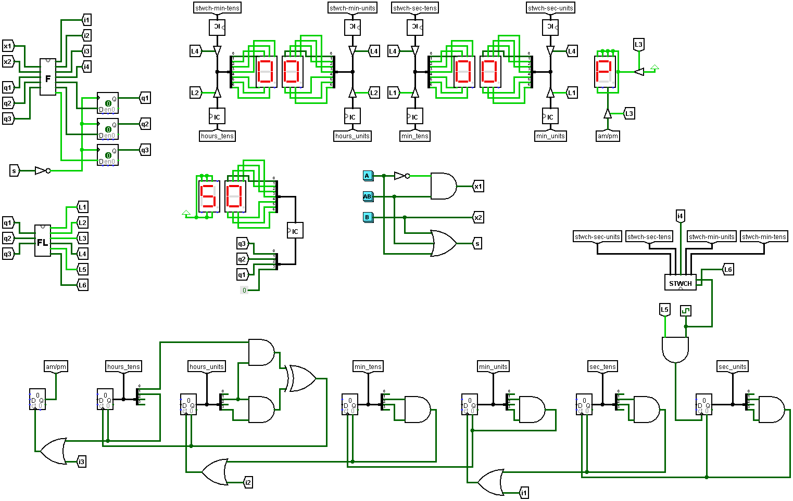

Проект представляет собой курсовую работу, посвящённую разработке функциональной схемы электронных часов. Часы реализованы с использованием программы **Logisim 2.7.1** и обладают следующими функциями:

- **Отображение времени:** Часы показывают текущее время в 12-часовом формате (AM/PM).
- **Корректировка времени:** Возможность изменения значений минут и часов с помощью кнопок управления.
- **Простой секундомер:** Функции запуска, остановки и сброса времени секундомера.
- **Остановка времени:** Приостановка текущего времени на экране с возможностью возобновления работы.

### Основные этапы разработки

1. Построение графа конечного автомата и описание его состояний.
2. Кодирование входных/выходных воздействий и состояний автомата.
3. Разработаны импульсные микрокоманды, отвечающие за кратковременные воздействия и потенциальные микрокоманды, управляющие отображением времени и подключением компонентов к генератору тактовых импульсов.
3. Минимизация функций блоков F (блок вычисления следующего состояния конечного автомата) и FL (блок формирования потенциальных микрокоманд).
4. Разработка общей функциональной схемы.
5. Оценка площади микросхемы на основе современной плотности транзисторов.

---

### Ниже приведена основная функциональная схема:

